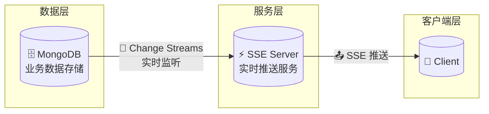
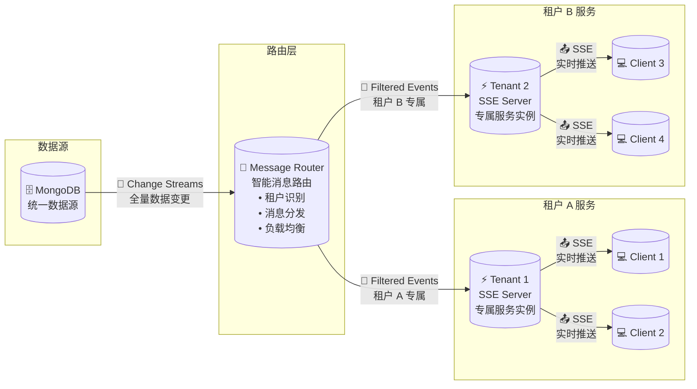
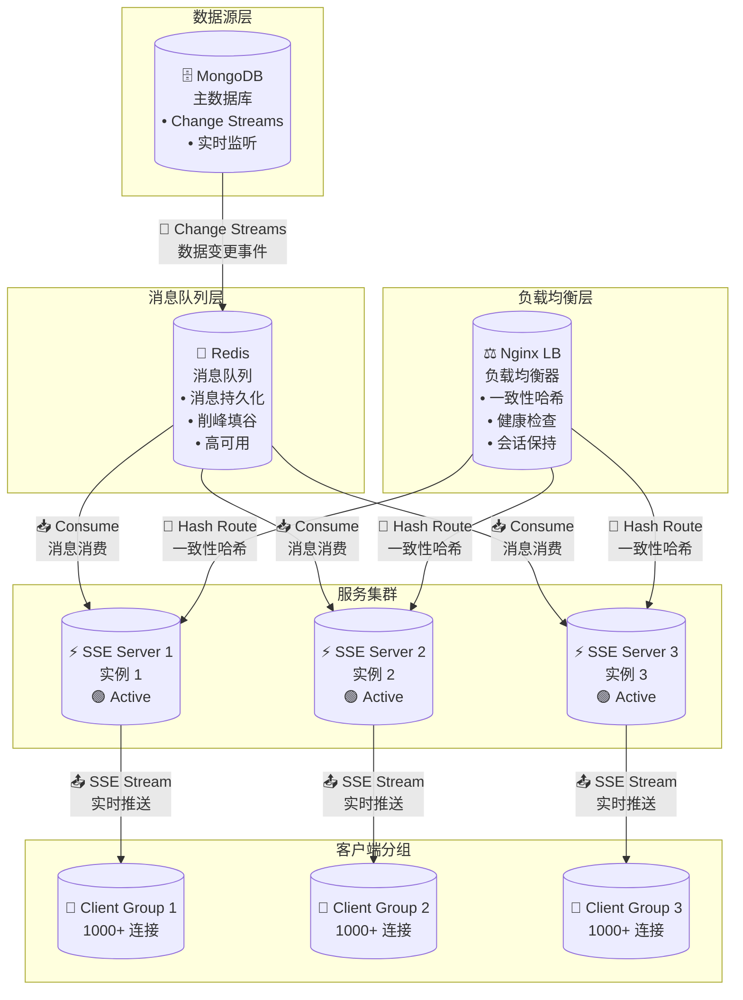
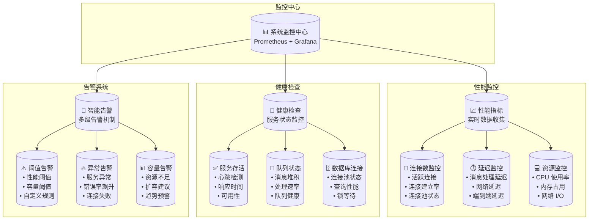
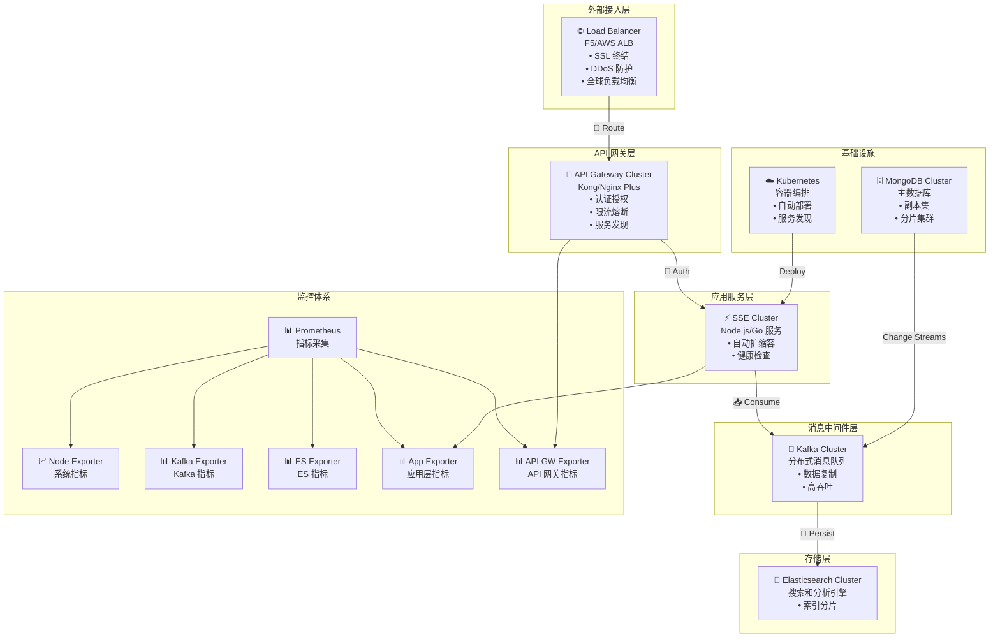
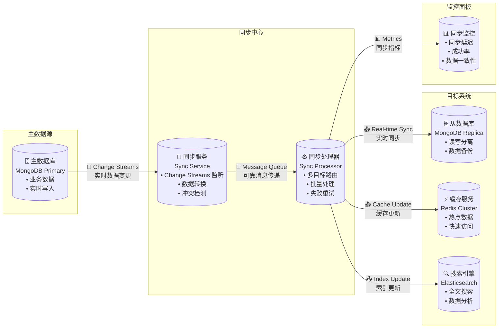

在上一篇[《MongoDB Change Streams 完全指南：从原理到实践》](/zh-cn/2025/05/24/mongodb-change-streams-complete-guide/)中，我们详细介绍了 MongoDB Change Streams 的基本概念和使用方法。本文将基于这些知识，探讨如何结合 Server-Sent Events (SSE) 构建一个可扩展的实时状态通知系统。我们将从最简单的实现开始，逐步增加系统的复杂度和功能，展示如何应对各种实际场景中的挑战[^1][^2]。

## 基础架构：简单的状态通知系统

### 系统需求分析

让我们从一个最小可用的场景开始：当数据库中的文档发生变化时，系统能够实时通知客户端。

这个系统的核心要求是**实时性**和**简单易维护**，适合小规模、单一业务场景。

### 基础架构设计

下图展示了最基础的系统架构，只有三个核心组件，结构非常简洁：



整个架构非常简洁，只有三个核心组件：**MongoDB 数据库**负责存储业务数据，**SSE 服务器**监听数据库变更并推送消息，**客户端**接收实时通知。

这个基础架构只适合用来当 Demo，能够快速实现实时通知功能，但我们需要的是一个完整的应用，现在这种架构在多租户、复杂过滤和高并发场景下会遇到瓶颈。系统需要支持多租户、消息过滤等更复杂的需求。


## 进阶架构：支持多租户和消息过滤

### 架构升级方案

解决上述问题很简单，只需要在基础架构的基础上，增加一个消息路由层，每个租户有独立的 SSE 服务器，支持消息过滤和多租户隔离：



这个升级版本的核心思想是**引入消息路由器**，每个租户有独立的 SSE 服务器，支持消息过滤和多租户隔离。

### 核心组件实现

让我们看看如何在 Nest.js [^3] 中实现这个进阶架构：

```typescript
// change-stream.service.ts
@Injectable()
export class ChangeStreamService {
  constructor(
    @InjectModel(User.name) private userModel: Model<User>,
  ) {}

  async watchChanges(tenantId: string, filters?: any) {
    // 构建 pipeline 用于过滤
    const pipeline = [
      {
        $match: {
          'fullDocument.tenantId': tenantId,
          ...filters
        }
      }
    ];

    const changeStream = this.userModel.watch(pipeline, {
      fullDocument: 'updateLookup'  // 获取完整的更新后文档
    });

    changeStream.on('change', (change) => {
      // 处理变更事件
      this.notifyClients(tenantId, change);
    });

    return changeStream;
  }
}

// sse.controller.ts
@Controller('events')
export class SSEController {
  private clients = new Map<string, Set<Response>>();  // 按租户 ID 分组存储客户端

  @Sse('stream')
  streamEvents(
    @Headers('x-tenant-id') tenantId: string,
    @Query('filters') filters?: string
  ): Observable<MessageEvent> {
    if (!tenantId) {
      throw new BadRequestException('Tenant ID is required');
    }

    return new Observable((subscriber) => {
      // 初始化租户的客户端集合
      if (!this.clients.has(tenantId)) {
        this.clients.set(tenantId, new Set());
      }

      const tenantClients = this.clients.get(tenantId)!;
      tenantClients.add(subscriber);

      // 解析过滤条件
      const parsedFilters = filters ? JSON.parse(filters) : {};

      // 启动 Change Stream
      const changeStream = this.changeStreamService.watchChanges(tenantId, parsedFilters);

      // 清理函数
      return () => {
        tenantClients.delete(subscriber);
        changeStream.close();

        // 如果租户没有活跃客户端，清理资源
        if (tenantClients.size === 0) {
          this.clients.delete(tenantId);
        }
      };
    });
  }

  notifyClients(tenantId: string, change: any) {
    const tenantClients = this.clients.get(tenantId);
    if (!tenantClients) return;

    tenantClients.forEach((client) => {
      client.next({
        data: change,
        type: 'message',
        id: Date.now().toString(),
      });
    });
  }
}
```

> 说明：这里只展示了核心逻辑，实际项目中还需处理异常、资源回收等细节。

### 这个方案怎么样？

首先，它**非常简单**，基本上一个周末就能搭建起来，实时性也很不错，延迟通常在几十毫秒以内。多租户隔离和消息过滤都能很好地支持，维护起来也不复杂，特别适合中小规模的应用。

但是，随着系统规模的增长，一些问题就开始暴露出来了。最明显的就是**连接数问题**：每个租户的 Change Streams 都要占用一个数据库连接，当租户数量增加时，数据库连接很快就会成为瓶颈。[^4]

另外，这个方案**不支持消息持久化**，一旦服务重启，正在传输的消息就丢失了。也没有消息重放机制，客户端断线重连后无法获取错过的消息。

更要命的是，Change Streams 的 pipeline 过滤**无法使用索引**[^4]，这意味着所有的变更事件都要经过 pipeline 处理。过滤条件越复杂，性能影响就越大，在高并发场景下很容易成为性能瓶颈。

### 性能优化建议

不过，我们还是有一些办法来缓解这些性能问题的。

**简化过滤逻辑**是最直接的方法。尽量避免复杂的过滤条件，优先使用简单的字段匹配，少用正则表达式这些重量级操作。

如果业务逻辑确实很复杂，可以考虑**把过滤逻辑移到应用层**。让 Change Streams 先把数据拉过来，然后在应用层做二次过滤。这样虽然会增加一些网络传输，但可以利用应用层的缓存机制，整体性能反而可能更好。

在配置 Change Streams 时也要注意一些细节。比如 `fullDocument: 'updateLookup'` 虽然方便，但会增加额外的查询开销。如果不是必须要完整文档，可以考虑用 `fullDocument: 'whenAvailable'`。另外，适当调整 `maxAwaitTimeMS` 可以控制轮询频率，在实时性和性能之间找到平衡。

最后，**监控是必不可少的**。要密切关注 Change Streams 的延迟情况，以及活跃连接数，设置合理的告警阈值。还要定期检查 oplog 的大小和状态，确保系统运行正常。

### 使用示例

客户端连接示例：

```javascript
// 连接 SSE 并指定租户 ID 和过滤条件，这里为了演示把数据库的过滤条件暴露给前端了，实际项目中需要注意安全问题
const eventSource = new EventSource(
  '/events/stream?filters=' + encodeURIComponent(JSON.stringify({
    operationType: 'update',
    'fullDocument.status': 'active'
  })), {
    headers: {
      'x-tenant-id': 'tenant-123'
    }
  }
);

eventSource.onmessage = (event) => {
  const change = JSON.parse(event.data);
  console.log('Received change:', change);
};
```

这个进阶架构已经能够满足多租户场景下的基本需求。通过 Change Streams 的 pipeline 参数，我们可以实现灵活的消息过滤，确保每个租户只能收到与其相关的数据变更通知。

## 高可用架构：处理大规模并发

### 系统瓶颈分析

当用户量突破万级别时，新的问题又出现了。最让人头疼的是**单点故障**：一旦 SSE 服务器挂了，所有客户端的连接都会断开，用户体验直接崩塌。

而且单台服务器的**连接数是有上限的**，通常在几千到几万之间，再多就扛不住了。在高并发场景下，消息还容易堆积，处理延迟越来越长。大量的长连接也会消耗大量的服务器资源，成本压力不小。

### 架构优化方案

下图展示了高可用架构的分层设计，重点在于消息队列解耦和负载均衡：



这个高可用架构的核心思想是**引入消息队列来解耦**。

为什么要用消息队列呢？想象一下，原来 MongoDB 的变更事件直接推送给客户端，就像是一条直通的管道。一旦某个环节出问题，整个流程就卡住了。

有了消息队列，就像在中间加了一个缓冲池。MongoDB 的变更事件先放到队列里，然后多个 SSE 服务器从队列里取消息推送给客户端。这样不仅能**削峰填谷**，处理突发的消息流量，还能保证**消息不丢失** —— 即使某台服务器挂了，消息还在队列里等着其他服务器来处理。

另外，我们用 **Nginx 做负载均衡**，通过一致性哈希把客户端分组，确保同一个客户端总是连接到同一台服务器，这样就能保持会话状态。多个 SSE 服务器实例并行工作，大大提高了系统的并发处理能力。

### 为什么选择 Redis 作为消息队列？

说到消息队列，你可能会想：为什么选择 Redis 而不是 Kafka 或者 RabbitMQ 这些专业的消息队列呢？

其实主要是考虑到**性能和简单性的平衡**。Redis 的 Pub/Sub 功能性能非常高，延迟通常在毫秒级别，完全满足实时推送的需求。而且 Redis 本身就是内存操作，速度快得飞起。[^5]

从**可靠性**角度来说，Redis 也不差。它支持消息持久化，有主从复制保证高可用，还支持事务操作。虽然不如 Kafka 那么重量级，但对于大多数场景已经足够了。

最重要的是**运维简单**。Redis 部署起来很轻松，配置也很灵活，监控工具和文档都很完善。相比之下，Kafka 虽然功能强大，但运维复杂度也高了不少。

从**成本**角度考虑，Redis 的资源占用比专业消息队列要少很多。对于中小规模的应用，Redis 的性能完全够用，而且不需要引入额外的组件，系统架构更简洁。

### 性能分析与对比

让我们来看看引入 Redis 消息队列后，性能到底提升了多少。

**MongoDB Change Streams 的瓶颈**每个 Change Streams 都要占用一个数据库连接，而 MongoDB 的连接池通常只有几百到一千个连接。每个连接大概占用 ​1-3MB​ 内存，消息处理延迟在 10-50ms 之间，这在高并发场景下很快就成为瓶颈。

**Redis 的优势**就很明显了。单个 Redis 连接可以处理多个订阅，内存占用只有 100KB 左右，可以支持数万个并发连接。最关键的是，消息处理延迟 ​通常低于 5ms (平均在 1-3ms 级别)​, ​并且整体吞吐能力极高，远超数据库连接驱动的限制。​​

**具体的性能提升**可以用数字说话：连接数从 MongoDB 的数百个提升到 Redis 的数万个，延迟从 10-50ms 降低到 ​通常低于 5ms，内存占用降低了 80-90%，并且 Redis ​支持集群部署提升整体容量和可用性。

在**实际应用**中，这种提升更加明显。对于小规模应用（1000 以下并发），延迟从 20-30ms 降到 2-3ms。中等规模（1000-10000 并发）时，MongoDB 直接监听极易出现连接池耗尽导致连接超时或延迟飙升到 50-100ms+，而 Redis 方案依然稳定在 5ms 以内。大规模应用（10000+ 并发）MongoDB 直接监听基本不可行，Redis 方案在合理设计的集群部署模式下仍能通过扩展继续支撑。

当然，**天下没有免费的午餐**。Redis 方案虽然性能更好，但也带来了额外的维护成本。你需要合理配置 Redis 的内存策略和持久化策略，还要监控内存使用和连接数，及时扩容。不过相比带来的性能提升，这些成本还是很值得的。

### 核心实现细节

```typescript
// message-queue.service.ts
@Injectable()
export class MessageQueueService {
  constructor(
    private readonly redisService: RedisService,
  ) {}

  async publishChange(change: any) {
    await this.redisService.publish('changes', JSON.stringify(change));
  }
}

// sse-server.service.ts
@Injectable()
export class SSEServerService {
  constructor(
    private readonly redisService: RedisService,
  ) {}

  async start() {
    const subscriber = this.redisService.createClient();
    await subscriber.subscribe('changes');

    subscriber.on('message', (channel, message) => {
      this.notifyClients(JSON.parse(message));
    });
  }
}
```

> 说明：完整实现还需考虑消息持久化、异常处理等。

这种方案的好处显而易见：我们充分利用了 **Nginx 成熟的负载均衡能力**，通过一致性哈希确保客户端总是连接到同一台服务器，保持会话状态。系统支持**动态扩缩容**，可以根据负载情况随时增减服务器实例。更重要的是，整个架构的**可观测性**大大提升，我们可以清楚地看到每个组件的运行状态。从开发角度来说，应用层的实现也变得更加简洁。

### 监控和告警机制

为了确保系统的稳定运行，我们需要实现以下监控指标：



## 企业级架构：完整的解决方案

### 企业级需求分析

1. **可靠性**：消息持久化、重放机制、自动故障转移，保证数据顺序和完整性。
2. **安全性**：认证授权、数据加密、审计日志、细粒度权限管理。
3. **性能与扩展性**：支持数万并发、低延迟、高吞吐，资源高效利用。
4. **运维与灾备**：全面监控告警、水平扩展、灾备能力、多区域部署。

### 完整架构设计

下图展示了企业级架构的分层与组件选型，突出高可靠与高安全：



### 技术选型建议

在企业级架构中，技术选型变得更加关键。

**消息队列的选择**主要看规模和需求。如果你的系统需要处理百万级 QPS，对消息持久化和重放有强需求，那 **Kafka** 是不二之选。它的生态系统非常成熟，分区和并行处理能力也很强，就是运维复杂度比较高。

如果你更看重实时性和简单性，**Redis Stream** 可能更合适。它的延迟极低，部署简单，对于中小规模应用或者资源受限的环境来说是个很好的选择。虽然功能没有 Kafka 那么全面，但胜在轻量级。

**消息存储**方面，如果你的系统本身就是基于 MongoDB，那继续用 **MongoDB** 存储消息是最自然的选择。它支持复杂查询，扩展性也不错，而且与源数据库保持一致，维护起来比较简单。

但如果你需要强大的全文搜索和数据分析能力，**Elasticsearch** 可能更适合。它的实时索引和分析功能非常强大，特别适合需要对消息内容进行深度分析的场景。

**API 网关**的选择主要看功能需求。**Kong** 的插件生态很丰富，性能也很好，还支持服务发现，适合功能需求比较复杂的场景。如果你只是需要简单的路由和负载均衡，**Nginx** 可能更合适，配置简单，性能稳定，资源占用也少。

**监控系统**方面，**Prometheus + Grafana** 的组合是目前最流行的选择。Prometheus 的查询语言很强大，Grafana 的可视化效果也很好，社区很活跃。如果你更注重日志分析，**ELK/PLG Stack** 可能更适合，可参考旧文[《Loki 生态系统入门指南》](/zh-cn/2024/07/08/plg-1-introducation/)，它的日志处理能力很强，而且使用起来比较简单。

### 核心组件实现

以下为企业级消息处理的关键代码片段：

```typescript
// message-processor.service.ts
@Injectable()
export class MessageProcessorService {
  constructor(
    private readonly kafkaService: KafkaService,
    private readonly elasticsearchService: ElasticsearchService,
  ) {}

  async processMessage(message: any) {
    // 1. 消息持久化
    await this.elasticsearchService.index('messages', message);

    // 2. 消息路由
    const route = this.determineRoute(message);
    await this.kafkaService.publish(route.topic, message);

    // 3. 消息追踪
    await this.traceMessage(message);
  }

  private determineRoute(message: any) {
    // 基于消息类型和租户信息确定路由
    return {
      topic: `tenant.${message.tenantId}.${message.type}`,
      partition: this.calculatePartition(message),
    };
  }
}
```

> 说明：完整实现需结合权限校验、监控埋点等。

### 部署架构


### 监控指标

企业级系统的监控需要从多个维度来考虑。

**系统层面**，我们要密切关注连接数的变化 —— 包括当前有多少活跃连接，连接建立的速率如何。消息处理的情况也很重要，比如每秒处理多少消息，平均延迟是多少。当然，基础的资源使用情况（CPU、内存、网络）也不能忽视，还要监控各种错误率，包括连接错误和处理错误。

**业务层面**的监控同样关键。我们需要了解有多少租户在活跃使用系统，消息在各个租户之间是如何分布的。不同类型的消息占比情况能帮我们了解业务特点，各个处理阶段的延迟分析能帮我们找到性能瓶颈。消息处理的成功率更是直接反映系统的健康状况。

**告警规则**要设置得合理而敏感。当连接数超过预期时要及时告警，避免系统过载。消息处理延迟过高时也要立即通知，因为这直接影响用户体验。错误率和资源使用率的阈值告警能帮我们提前发现问题，避免系统崩溃。

### 灾备方案

企业级系统必须要有完善的灾备能力，这关系到业务的连续性。

**多区域部署**是基础。你可以选择主备模式，平时只有一个主区域提供服务，其他区域作为备用；也可以选择双活模式，多个区域同时提供服务，这样能更好地分散负载。无论哪种模式，都要实现客户端就近接入，让用户总是连接到最近的区域，获得最佳的访问体验。

**数据同步**是灾备的核心。消息要在各个区域之间实时复制，确保数据的一致性。集群的状态信息也要同步，这样在切换时新的区域能够无缝接管。配置信息的同步同样重要，避免因为配置不一致导致的问题。

**故障转移**机制要既自动又可控。系统要能够自动检测故障并进行切换，减少人工干预的时间。但同时也要支持手动切换，在某些特殊情况下运维人员可以主动进行切换。当原来的区域恢复后，还要支持回切机制，让系统回到最优的状态。

## 实际应用案例

### 实时数据同步场景

下图展示了多目标同步的整体流程：



这个架构的亮点在于**支持多目标同步**：一次数据变更可以同时同步到从数据库、缓存服务和搜索引擎。同时能够**保证数据一致性**，支持**断点续传**，还可以实时**监控同步状态**，非常适合复杂的数据同步场景。

## 总结与最佳实践

### 架构演进总结

回顾整个架构演进过程，我们从最简单的基础架构开始，逐步解决了实际应用中遇到的各种问题。**基础架构**让我们快速实现了实时通知功能，**进阶架构**解决了多租户和消息过滤的需求，**高可用架构**应对了大规模并发的挑战，最后的**企业级架构**提供了一个功能完整、生产就绪的解决方案。

### 关键技术点回顾

- **MongoDB Change Streams** 是整个系统的数据源，它能够实时监听数据变更，支持灵活的过滤和聚合操作，还能保证消息的顺序性，为后续的处理提供了可靠的基础。

- **Server-Sent Events** 作为客户端通信的桥梁，提供了简单高效的单向实时通信能力。它的自动重连机制和低延迟特性，让客户端能够稳定地接收实时消息。

- **消息队列**在高可用架构中起到了关键的解耦作用。它不仅能够削峰填谷，处理突发流量，还提供了消息持久化能力，大大提升了系统的可靠性。

- **负载均衡**则确保了系统的可扩展性。通过智能的连接分发、服务发现和健康检查，让系统能够水平扩展，应对不断增长的用户需求。

## P.S.：为什么选择 SSE 而不是 WebSocket

1. 首先，因为标题已经说了今天的主题是 SSE，所以选择 SSE 是理所当然的 :P
2. 其次，在实时数据推送场景下，SSE 更适合单向推送，开发和运维都非常简单，且基于 HTTP 协议，兼容企业网络和代理环境，浏览器支持自动重连，适合大多数通知和数据同步需求。WebSocket 虽然功能更强大，支持双向通信和高频交互，但在本场景下属于过度设计，复杂度和运维成本更高。

## 参考资料
[^1]: [MongoDB Change Streams Documentation](https://www.mongodb.com/docs/manual/changeStreams/)
[^2]: [Server-Sent Events Specification](https://html.spec.whatwg.org/multipage/server-sent-events.html)
[^3]: [NestJS SSE Documentation](https://docs.nestjs.com/techniques/server-sent-events)
[^4]: [MongoDB Change Streams Production Recommendations](https://www.mongodb.com/docs/manual/administration/change-streams-production-recommendations/)
[^5]: [Redis Pub/Sub Documentation](https://redis.io/topics/pubsub)


