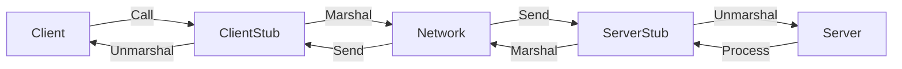
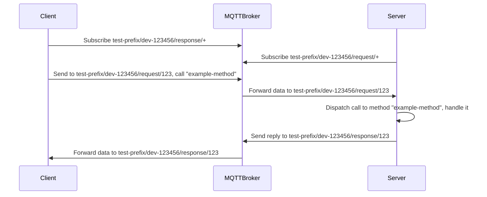

今天，我将向大家介绍我基于 Golang 实现的 MQTT 反向 RPC 框架：[Go reverse RPC](https://github.com/xizhibei/go-reverse-rpc)。

### RRPC 的定义

RRPC 即 Revese RPC，我们一般称设备端向服务端请求成为 RPC(Remote Protocal Call)，所以反向即服务端向设备端请求，这在设备端是常见的做法，因为设备端没有独立的公网 IP，服务器端无法直接向设备端请求，这种情况下，就需要设备端发起一个长链接到服务器端，然后服务器就能在这个长链接的基础上，对设备端进行 RPC 请求。

<!-- more -->

### 为什么需要 RRPC

首先是因为 MQTT 3.1/3.1.1 并没有对请求回复模式的原生的支持，直到 MQTT 5 才提供，其次就是我们通常用的发布订阅模式来实现 RPC 要么是针对每个方法进行单独的处理。其次在 Golang 中，相对于 HTTP 协议的中的 Gin、Beego、Echo 等优秀框架，MQTT 并没有现成并且好用的框架，我们经常实现的方式就是针对每个需要回复的地方单独处理，容易造成大量冗余的代码，不优雅，另一种方式是用数据库来记录请求，从而将请求跟响应联系起来，显然，如果是针对调用设备端的服务而言，这种实现方式跟数据库有耦合存在，不仅实现起来有些复杂，也容易在数据库中留下大量无法配对的请求，而且性能也不会太好。于是 RRPC 就出现了，它针对我们服务器对现成设备的服务调用提供了简洁、高效的实现方式，特别是在与第三方云平台的 MQTT 物联网协议对接时。

### 功能点

RRPC 的基本原理已经明确，现在我们来看一下它的功能点：

- 支持 MQTT 长连接协议（目前只实现了 MQTT）
- 支持 Protobuf 以及 JSON 等多种编码格式
- 支持数据压缩：GZip/Zlib/Brotli
- 提供监控：指标、日志以及追踪
- 支持错误恢复以及处理

### 如何使用

在这个项目的使用场景中，Client 代表客户端（在服务器端中使用），Server 代表服务端（在设备端中使用）。


首先，我们需要新建一个 MQTT 客户端实例，然后在服务端创建以及注册调用的方法：

```go
import (
    "github.com/xizhibei/go-reverse-rpc/mqttpb"
    "github.com/xizhibei/go-reverse-rpc/mqttadapter"
)

mqttClient, err := mqttadapter.New("tcp://localhost", "client-id-123456-server")
if err != nil {
    panic(err)
}

server := mqttpb.NewServer(
    mqttClient,
    "test-prefix",
    "dev-123456",
)

server.Register("example-method", &rrpc.Handler{
    Method: func(c rrpc.Context) {
        var req Req
        err := c.Bind(&req)
        if err != nil {
            c.ReplyError(rrpc.RPCStatusClientError, err)
            return
        }

        // your business logic ...

        c.ReplyOK(req)
    },
    Timeout: 5 * time.Second,
})
```

不知道你有没有看到 Gin 的身影，我参照了它的设计。

然后，我们需要在客户端中，也是一样，创建一个 MQTT 客户端实例，然后向服务端进行请求：

```go
import (
    "github.com/xizhibei/go-reverse-rpc/mqttpb"
    "github.com/xizhibei/go-reverse-rpc/mqttadapter"
)

mqttClient, err := mqttadapter.New("tcp://localhost", "client-id-123456-client")
if err != nil {
    panic(err)
}

client := mqttpb.New(
    mqttClient,
    "test-prefix",
    mqttpb.ContentEncoding_GZIP,
)

var res Req
err := client.Call(context.Background(), "dev-123456", "example-method", &reqParams, &res)
```

从上面的例子中，大家应该有初步的印象了，其中的关键在于：

1. 连接到同一个 MQTT Broker `tcp://localhost`；
2. 服务端需要先注册好 `example-method` 所对应的方法，并实现业务逻辑；
3. 客户端发送请求调用设备号为 `dev-123456` 的 `example-method` 的方法；

### 设计与实现

从设计本身而言，并没有什么复杂的地方，因为本质上它还是所谓的 RPC，所以，先让我们来看看流程图：



从中可以看到，主要的模块也就客户端以及服务端，客户端承担的职责是发送请求以及接收回复，服务端承担的职责是接收以及处理请求，要达到发送，接收处理以及返回。因此两边必然要有基础的协议来进行序列化以及反序列化，以及发送以及接收数据流。

那么，上面的例子的原理是什么呢？让我们用时序图来解释：



这里有几个非常关键的地方：

1. `request` 以及 `response` 这两个关键词是约定好的，当前设计不可修改，后续可以考虑改为可修改；
2. `request` 以及 `response` 后面建议加上唯一的请求 ID，方便 RPC 解析处理；
3. `Publish` 以及 `Subscribe` 的 QoS 默认为 0，且不可修改（思考题：为什么？）；

另外一个值得注意的地方在于，这个 RRPC 框架同时支持 JSON 以及 Protobuf 两种序列化与反序列化方式，因此如果是为了传输数据的可读性，那么选 JSON 即可，而如果是在意效率，那么 Protobuf 就是你的选择。在设备的性能以及电能足够的前提下，还可以选择给 Protobuf 启用数据压缩，目前支持 GZip/Zlib/Brotli，这样就能进一步的节约网络流量，JSON 暂时不支持数据压缩，毕竟需要用到 JSON 的场景下，都是以纯文本为主。


### 计划

- 这个库的 MQTT 协议是以 [paho.mqtt.golang](https://github.com/eclipse/paho.mqtt.golang) 为基础的，它目前只支持 MQTT 3.1/3.1.1 版本，因此之后会计划支持 MQTT 5 支持。实际上对于 MQTT 5 协议，其实是更适合改造的，[毕竟它在协议层面就支持了 RPC 模式](https://www.hivemq.com/blog/mqtt5-essentials-part9-request-response-pattern/)；
- 计划支持常用的长连接协议：WebSocket 以及 AMQP 协议支持；
- 长期来看，如果项目越来越多人用的话，会考虑参考 gRPC 的方式，即定一个协议文件，生成相关的 SDK；
- 目前程序可观测性方面仅支持 Prometheus，计划在之后支持 OpenTelemetry；
- 其它语言的版本 Node.js / Java / C++ 等；

### 总结

目前整个框架还是有许多不足之处，也没有得到广泛的验证，只在之前公司的项目中得到了应用，这也是我将它开源出来的目的，希望物联网开发者可以考虑下这个框架并且提出你的宝贵意见。

最后，如果可以的话，请帮忙点个 [Star](https://github.com/xizhibei/go-reverse-rpc) 吧！